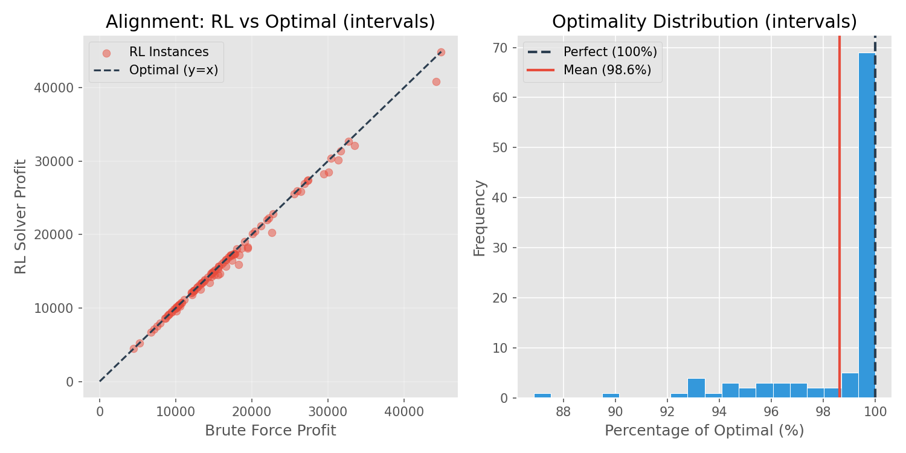

# 📊 RL Solver Performance Report: `intervals`
**Generated:** 2026-01-08 12:17

## 1. Executive Summary
The RL solver achieved a mean performance of **98.62%** relative to the Brute Force optimum. 
In **48.0%** of cases, the RL solver matched the optimal solution perfectly.

---

## 2. Detailed Statistics

| Metric | Brute Force (Target) | RL Solver (Agent) |
| :--- | :--- | :--- |
| **Mean Profit** | $16,496.51 | $16,217.40 |
| **Std Deviation** | 7624.85 | 7382.15 |
| **Median Ratio** | — | **100.00%** |
| **Worst 5% (Tail)**| — | < 93.24% |

---

## 3. Hypothesis Testing

### ✅ Non-Inferiority Test (Threshold: 95%)
*Is the RL solver reliably "not worse" than 95% of the optimal solution?*
* **P-Value:** `0.000000` (Extremely Significant)
* **Result:** The RL solver **is** statistically non-inferior.

### ✅ Equivalence Test (TOST)
*Is the solver consistent? (Does it stay within 5% of its average behavior?)*
* **P-Value:** `0.000000`
* **Result:** Equivalence confirmed.

### Direct Difference (Paired t-test)
* **T-Statistic:** 4.76
* **Result:** Statistically significant difference (RL is not identical to BF).

